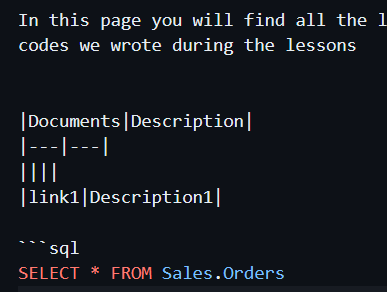

# sql

Here will be saved the SQL queries

## table of contents

In this page you will find all the links to the sql codes we wrote during the lessons


|Documents|Description|
|---|---|
||||
|link1|Description1|

```sql
SELECT * FROM Sales.Orders
```
